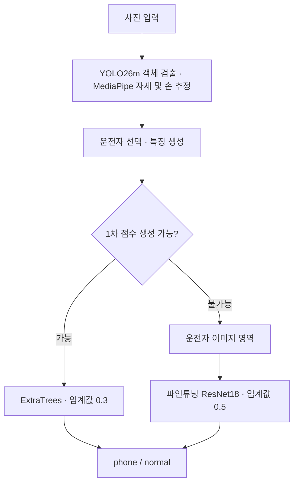

# 운전자 휴대폰 소지 판별 시스템 개발 보고서

**주제: 운전자와 동승자를 구분하는 특징 기반 분류와 이미지 기반 보완 분류의 결합**

- 작성 기준: 2026-09-16, 팀 공통 데이터로 재학습한 현재 기본 모델
- 구성: YOLO26m + MediaPipe + ExtraTrees → 필요 시 ResNet18
- 공통 데이터: train 911장 / test 146장
- 최종 결과: **Accuracy 88.36%, Precision 85.71%, Recall 93.51%, F1 89.44%**

> 이 보고서는 **분류 모델 선택 방식 → 초기 결과 → 원인 분석과 개선 → 최종 결과** 순서로 정리했다. 마지막에는 자기소개서·이력서·프로젝트 발표에 활용할 수 있는 문장 예시를 담았다. 서로 다른 데이터나 평가 분모에서 얻은 수치를 하나의 연속적인 성능 향상으로 합치지 않았다.

## 1. 분류 모델 선택 방식

### 1.1 문제 정의: 휴대폰의 존재보다 ‘누가 들고 있는가’

목표는 백미러 부근에서 촬영한 차량 실내 사진에서 **운전자가 휴대폰을 들고 있는지** 판단하는 것이다. 조수석·2열 승객이 존재할 수 있으므로, 사진에서 휴대폰을 발견하는 것만으로는 양성을 결정할 수 없다.

이에 문제를 세 단계로 나눴다.

1. **객체 검출:** 사람과 휴대폰의 위치를 찾는다.
2. **소유 관계 판단:** 운전자를 선택하고, 손·팔과 휴대폰의 관계를 계산한다.
3. **행동 분류:** 그 관계를 이용해 운전자의 휴대폰 소지 여부를 판단한다.

데이터의 `보고있음`과 `들고있음`은 동일한 양성 의미로 취급했다. 현재 폴더명은 양성 `phone`, 음성 `normal`이다. 시선 방향을 별도로 분류하는 과제가 아니므로, 운전자가 전방을 보면서 휴대폰을 들고 있어도 양성이다.

### 1.2 처음 선택한 모델과 역할

| 구성 요소 | 선택 근거 | 맡긴 역할 | 우리 데이터로 학습 여부 |
|---|---|---|---|
| YOLO26n | 기본 모델에 사람·휴대폰 클래스가 있어 기존 검출 성능부터 확인 가능 | 객체 위치 검출 | 사용하지 않음: 사전학습 가중치 그대로 |
| MediaPipe Pose / Hand | 몸·손 관절을 이용해 사람과 물체의 공간 관계를 수치화 가능 | 어깨·팔·손 관절 추출 | 사용하지 않음: 사전학습 가중치 그대로 |
| ExtraTrees | 거리·각도·가시성 등 수치 특징의 비선형 관계를 학습하는 데 활용 | 최종 소지 여부 이진 분류 | 사용함 |

초기에는 손과 휴대폰의 거리, 좌석 위치 등을 규칙으로 판단하는 방식부터 시작했다. 이후 정규화된 자세·손 특징을 ExtraTrees에 입력하는 데이터 기반 분류로 확장했다.

ExtraTrees를 선택한 이유는 입력이 이미지 자체가 아니라 거리·각도 등의 수치였기 때문이다. 다만 여러 표 형식 분류기를 체계적으로 비교해 ExtraTrees의 우월성을 입증한 실험은 아니며, 이 프로젝트에서 채택한 구현 모델로 설명하는 것이 정확하다.

### 1.3 성능 판단 기준

- **Precision:** 휴대폰을 들었다고 판정한 사진 중 실제 양성 비율. 동승자 때문에 발생하는 오탐을 확인한다.
- **Recall:** 실제 양성 중 찾아낸 비율. 운전자의 휴대폰 소지를 놓치는 미탐을 확인한다.
- **F1:** Precision과 Recall을 함께 고려하는 지표. 최종 설정 선택의 기준으로 사용했다.
- **전체 처리 비율:** 판단하기 어려운 사진을 제외해 지표가 높아지는 현상을 확인한다.

단순 정확도 외에 오탐·미탐과 판단 실패 사진을 함께 살피는 방식으로 평가했다.

## 2. 초기 결과: 휴대폰 미탐과 평가 분모의 문제 확인

초기 YOLO26n 기반 모델을 과거 개발 데이터 `new dataset` 639장에 적용했다. 이 중 점수를 계산할 수 있는 637장에 임계값 0.5를 적용한 결과다.

| 항목 | 초기 결과 |
|---|---:|
| Accuracy | 74.41% |
| Precision | 84.00% |
| Recall | 56.19% |
| F1 | 67.33% |
| 오탐 / 미탐 | 32장 / 131장 |

가장 큰 문제는 **실제 휴대폰 소지 장면을 놓치는 것**이었다. 따라서 바로 새 검출기를 학습하기보다, 기존 검출기의 크기와 후속 분류 로직 중 어디에서 정보가 손실되는지 확인했다.

동시에 이 결과는 점수가 없는 2장을 제외한 수치라는 점을 구분했다. 이후에는 판단 실패 사진을 제외한 Recall과 전체 양성 중 실제로 찾아낸 비율을 별도로 확인하게 됐다.

**해석 범위:** 위 수치는 과거 개발 평가다. 뒤에 나오는 최종 공통 test 146장 결과와 데이터 구성이 다르므로 직접적인 전후 비교 수치로 사용하지 않는다.

## 3. 개선: 검출·소유 관계·판단 실패를 나눠 해결

### 3.1 개선 1 — YOLO 모델 크기를 키워 검출 누락 감소

휴대폰 클래스가 이미 사전학습 모델에 포함돼 있으므로, 먼저 YOLO26n을 YOLO26m으로 변경해 비교했다. 이 비교에서는 같은 개발 사진과 고정된 후속 분류기를 사용했다.

| 검출기 | 평가 장수 | Precision | Recall | F1 | 미탐 |
|---|---:|---:|---:|---:|---:|
| YOLO26n | 637 | 84.00% | 56.19% | 67.33% | 131 |
| YOLO26m | 637 | 90.32% | 74.92% | 81.90% | 75 |

이 조건에서 F1은 **14.57%p**, Recall은 **18.73%p** 상승했고 미탐은 **131장 → 75장**으로 줄었다. 따라서 별도 YOLO 파인튜닝 없이 m 모델을 후속 실험의 검출기로 채택했다.

이후 YOLO를 GPU에서 실행하도록 구성했다. GPU 사용은 처리 속도 개선을 위한 조치이며, 그 자체를 정확도 향상 원인으로 설명하지 않는다.

### 3.2 개선 2 — 동승자 대체 방지와 손바닥·손가락 거리 추가

남은 오분류를 사진과 중간 검출 결과로 확인하면서 두 가지 구조적 문제를 찾았다.

| 발견한 문제 | 개선 내용 |
|---|---|
| 운전자 자세가 누락되고 동승자 자세만 남으면, 동승자를 운전자로 선택할 수 있음 | YOLO 사람 박스로 운전자 후보를 먼저 정하고 그 박스에 연결되는 자세만 사용 |
| 휴대폰이 손가락 쪽에 있으면 손목 거리만으로 접촉 근거가 약해짐 | 손바닥 중심 및 다섯 손가락 끝과 휴대폰 박스의 거리 추가 |

양손과 다른 사람의 손도 비교해 휴대폰 소유 관계의 근거로 사용했다. 사람마다 크기가 다르다는 점을 고려해 거리를 어깨 너비 등으로 정규화했다.

두 버전 모두 점수를 계산할 수 있는 **동일한 577장**에서 비교한 결과다.

| 버전 | Accuracy | Precision | Recall | F1 |
|---|---:|---:|---:|---:|
| 개선 전 | 85.27% | 92.89% | 75.18% | 83.10% |
| 개선 후 | 88.73% | 94.19% | 81.65% | 87.48% |

다만 운전자 선택 규칙·특징 추가·재학습이 함께 적용됐으므로, 이 차이를 특정 특징 하나의 효과로 단정할 수 없다. 운전자 식별을 엄격하게 하면서 점수를 만들 수 없는 사진도 늘었다. 이후 개선은 이 실패 경로를 처리하는 데 집중했다.

### 3.3 개선 3 — ‘점수 없음’을 양성과 동일하게 취급하지 않기

1차에서 **점수가 없다는 것은 휴대폰 소지 가능성이 낮다는 의미가 아니다.** 운전자 자세가 없거나 신뢰할 수 있는 관절이 없어 분류기에 넣을 특징을 만들지 못한 상태다.

처음에는 최종 출력을 반드시 이진으로 만들기 위해, 점수가 없는 사진을 모두 양성으로 처리하는 정책을 실험했다. Recall을 높일 수 있었지만, 실제 음성 사진까지 양성이 되는 문제가 있었다.

이에 판단 근거를 바꿨다.

> 자세·손 좌표를 만들 수 없는 사진은 원본 이미지의 시각적 정보로 다시 분류한다.

ImageNet 사전학습 ResNet18을 가져와 우리 데이터의 운전자 영역으로 파인튜닝했다. 여기서 ImageNet은 초기 가중치를 제공한 것이며, 운전자의 휴대폰 소지 라벨을 학습한 데이터는 우리 train이다.

- 운전자 사람 박스가 있으면 손·팔 주변 여유를 포함해 잘라낸다.
- 사람 박스도 없으면 지정된 운전석 영역을 사용한다. 기본값은 사진 오른쪽 60%다.
- 이미지는 종횡비를 유지해 320×320으로 맞춘다.
- 2차 모델은 실패 사진만이 아니라 train 전체의 운전자 영역으로 학습한다.

### 3.4 최종 구조 — 1차가 처리하지 못한 사진만 2차로 전달

두 모델의 점수를 평균 내거나 별도 결합 분류기를 학습한 구조는 아니다. **1차 점수가 없는 경우에만 2차로 전달**하며, 1차 점수가 중간이거나 낮다는 이유로 전달하지 않는다. 최종 출력에는 판단 불가를 두지 않는다. 파일 손상 같은 실행 오류는 오류로 보고한다.

### 3.5 개선 4 — 팀 비교를 위한 데이터와 평가 기준 통일

팀원들이 서로 다른 방법을 시도하는 상황에서는 학습셋이 다른 모델끼리의 최고 점수만 비교하면 방법 자체의 차이를 판단하기 어렵다. 따라서 수정된 공통 데이터를 기준으로 재학습했다.

| 분할 | 양성 phone | 음성 normal | 합계 |
|---|---:|---:|---:|
| train | 401 | 510 | 911 |
| test | 77 | 69 | 146 |

재학습 과정은 다음과 같다.

1. train을 촬영 번호 100단위 묶음 기준으로 **학습 619장 / 검증 292장**으로 분리했다.
2. 1차 ExtraTrees와 2차 ResNet18을 각각 학습했다.
3. train 내부 검증에서 최대 8 epoch와 두 단계 임계값 조합을 비교했다.
4. 결합 시스템의 검증 F1을 기준으로 **5 epoch, 1차 0.3 / 2차 0.5**를 선택했다.
5. 설정을 고정한 뒤 train 전체로 두 모델을 각각 새로 학습했다. 1차는 특징 생성이 가능한 **825장**, 2차는 **911장 전체**를 사용했다.
6. test 146장 전체에서 평가했다. 이번 재학습에서는 test를 보고 임계값이나 학습 횟수를 조정하지 않았다.

학습·평가 파일의 상대 경로, 라벨, SHA-256을 저장해 팀원 간 데이터 일치를 확인할 수 있도록 했다. train/test의 동일 파일 중복은 0장이며, 내부 검증 분할도 해시 목록으로 보존했다. 기존 모델과 가중치는 `old`에 보관하고 공통 데이터 재학습 모델을 기본으로 전환했다.

## 4. 최종 결과: 전체 사진을 평가하고 교환관계까지 확인

### 4.1 같은 학습셋·같은 test에서 비교

아래 세 방식은 모두 수정된 공통 train으로 학습한 모델을 사용하고, **동일한 test 146장 전체**를 평가했다. 판단 불가 사진을 제외하지 않았다.

| 방식 | Accuracy | Precision | Recall | F1 | 오탐 FP | 미탐 FN |
|---|---:|---:|---:|---:|---:|---:|
| 1차 + 점수 없음 양성 처리 | 84.93% | 78.35% | **98.70%** | 87.36% | 21 | **1** |
| **최종 1차+2차** | **88.36%** | 85.71% | 93.51% | **89.44%** | 12 | 5 |
| 이미지 분류기 단독 | 81.51% | **87.88%** | 75.32% | 81.12% | **8** | 19 |

최종안은 1차의 점수 결측을 모두 양성 처리하던 방식과 비교해 다음 결과를 얻었다.

- **F1: 87.36% → 89.44%, 2.08%p 상승**
- **오탐: 21장 → 12장, 9장 감소(약 42.9%)**
- **미탐: 1장 → 5장 증가**
- **Recall: 98.70% → 93.51% 감소**

즉, 오탐과 F1을 개선했지만 미탐까지 동시에 개선한 것은 아니다. 휴대폰 소지를 놓치지 않는 것이 절대적인 우선순위라면, 양성 처리 정책의 높은 Recall도 별도로 고려해야 한다.

이미지 분류기 단독은 미탐이 19장으로 많았다. 이번 조건에서는 이미지 모델로 전체 판단을 대체하는 것보다 **특징 기반 분류기의 실패 경로를 보완하는 용도**로 사용하는 편이 F1이 높았다.

### 4.2 최종 혼동행렬과 실패 사진

| 실제 라벨 | normal 예측 | phone 예측 |
|---|---:|---:|
| normal 69장 | 57 | 12 |
| phone 77장 | 5 | 72 |

2차로 전달된 사진은 22장(양성 11·음성 11)이었다. 이 중 양성 7장과 음성 9장을 맞혔다.

| 오류 종류 | 1차에서 발생 | 2차에서 발생 | 합계 |
|---|---:|---:|---:|
| 오탐: normal → phone | 10 | 2 | 12 |
| 미탐: phone → normal | 1 | 4 | 5 |

오탐·미탐 사진을 원본 복사본, 모음 이미지, 예측 점수 목록으로 정리해 재검토할 수 있게 했다. 미탐 5장 중 4장이 2차에서 발생했으므로, 다음 개선에서는 2차에 전달되는 어려운 양성 사례를 우선 확인할 근거를 얻었다. 다만 오류 건수가 적으므로 이것만으로 일반적인 실패 원인을 확정하지는 않는다.

### 4.3 더 높은 점수의 이전 모델을 기본으로 사용하지 않은 이유

이전 train 1,011장으로 학습한 모델을 현재 test 146장에 적용하면 F1은 90.68%로, 재학습 모델의 89.44%보다 높았다. 그러나 **학습셋이 달라 팀 공통 조건의 비교 대상과 구분해야 했다.**

따라서 최고 숫자만을 기준으로 이전 모델을 유지하지 않고, 팀원과 동일한 train/test를 사용한 재학습 모델을 최종 기본으로 채택했다. 이전 모델은 삭제하지 않고 `artifacts/old/`에 보관했다.

이 결정은 “재학습으로 이전 모델보다 성능이 좋아졌다”는 의미가 아니다. **공정한 비교와 재현 가능한 실험 기준을 우선한 결정**이다.

### 4.4 처리 속도와 아직 해결하지 못한 부분

정확도 평가 후 실제 처리 시간을 별도로 측정했다.

| 측정 조건·항목 | 결과 |
|---|---|
| 장치 | NVIDIA RTX 4050 Laptop GPU |
| 표본 | 30장: 1차 판정 24장 / 2차 판정 6장 |
| 실행 방식 | 모델 상주, 준비 실행 후, 사진 1장씩 직렬 처리 |
| 포함 / 제외 | 원본 파일 읽기·추론 포함 / 결과 이미지 저장·초기 로딩 제외 |
| 평균 처리 시간 | **약 751ms/장** |
| 95백분위 처리 시간 | 약 874ms |
| 직렬 처리 속도 | 약 1.33장/초 |
| 33.3ms 이내 처리 | 0/30장 |

현재 구현은 **30fps 실시간 요구를 충족하지 못했다.** 측정에는 동기화 계측 비용이 포함되며 표본 수가 작지만, 모델을 미리 로드한 조건에서도 목표와 차이가 컸다. 따라서 GPU로 실행했다는 사실을 실시간 구현 성공으로 표현하지 않는다.

후속 과제는 운전자 영역 중심 처리, 반복 검출 축소, 입력 해상도 조정 등이다. 이러한 변경은 아직 성능을 검증하지 않았으며, 속도 개선과 정확도 손실을 함께 평가해야 한다.

### 4.5 평가 결과의 범위

- 현재 test 중 140장은 과거 평가 사진이고 6장이 추가됐다. 완전히 새로운 외부 일반화 성능으로 해석하지 않는다.
- 촬영 번호 묶음 분리는 같은 인물·차량·촬영 세션을 완전히 분리한다는 보장이 없다.
- 내부 검증에서 2차 대상은 14장이며 양성이 2장뿐이었다. 그 부분의 검증 성능이 100%였어도 test에서는 그대로 유지되지 않았다.
- 검출기 확대, 특징 개선, 최종 공통 데이터 평가의 분모가 다르다. **F1 67.33% → 89.44%를 동일 조건의 단일 개선 폭으로 표현하지 않는다.**
- 실제 차량의 야간·역광·가림·좌석 배치 변화는 추가 검증이 필요하다.

## 5. 프로젝트에서 보여줄 수 있는 역량

| 역량 | 이 프로젝트에서 수행한 내용 |
|---|---|
| 문제 정의 | 휴대폰 존재 검출과 운전자 소지 판단을 구분하고 동승자 영향을 요구사항에 반영 |
| 모델 선택 | 객체 검출·관절 추정·수치 특징 분류·이미지 분류에 서로 다른 모델 역할 부여 |
| 오류 분석 | 오탐·미탐 사진과 중간 검출 결과를 확인해 모델 크기, 운전자 연결, 거리 특징 문제를 분리 |
| 구조 개선 | 1차 특징 생성 실패를 이미지 기반 2차 모델로 보완하는 조건부 처리 구조 구현 |
| 평가 설계 | Precision·Recall·F1과 전체 평가 분모를 함께 확인하고 결측 양성 정책의 교환관계 설명 |
| 협업·재현성 | 공통 train/test 목록과 해시, 내부 검증 분할, 모델 설정·가중치 해시 및 old 모델 보존 |
| 한계 검증 | 실시간 처리 여부를 실제 측정하고 30fps 미달과 외부 검증 한계를 기록 |

## 6. 자기소개서·프로젝트 설명에 활용할 문장

다음 문장은 본인이 실제로 맡은 범위에 맞춰 조정해 사용할 수 있다. 팀 내 역할이나 다른 팀원 대비 우위를 확인하지 않은 상태에서 단독 성과·최고 성능으로 표현하지 않는다.

### 6.1 이력서용 한 문장

> 운전자 자세 특징 기반 분류와 ImageNet 기반 이미지 분류를 결합한 휴대폰 소지 판별 시스템을 구현하고, 공통 test 146장에서 F1 89.44%·Recall 93.51%를 달성했습니다.

### 6.2 이력서용 핵심 성과 세 줄

- YOLO26m·MediaPipe로 운전자와 손·휴대폰의 관계를 추출하고, 특징 생성 실패 시 ResNet18로 보완하는 2단계 분류 구조를 구현했습니다.
- 동일한 학습·평가 조건에서 점수 결측을 모두 양성 처리하는 방식 대비 오탐을 21장→12장으로 줄이고 F1을 87.36%→89.44%로 개선했습니다. Recall 감소도 함께 확인했습니다.
- 팀 공통 train 911장·test 146장을 파일 해시로 관리하고, 검증 기반 설정 선택·오류 이미지 수집·실행 시간 측정을 통해 비교 가능한 실험 기록을 마련했습니다.

### 6.3 자기소개서용 서술 예시

> 운전자 휴대폰 소지 판별 프로젝트에서 객체 검출 성능뿐 아니라 판단 대상과 실패 처리 방식까지 살펴보는 경험을 했습니다. 처음에는 휴대폰과 손의 위치를 활용했지만, 운전자 자세가 누락되면 동승자를 잘못 선택하거나 최종 점수를 만들지 못하는 문제가 발생했습니다. 오분류 사진과 중간 결과를 분석해 운전자 사람 박스와 자세의 연결 조건을 강화하고 손바닥·손가락 거리 특징을 추가했습니다. 이후 특징을 만들 수 없는 사진은 ImageNet 기반 이미지 분류기로 전달하는 2단계 구조를 구현했습니다. 팀 공통 데이터에서 결측을 모두 양성 처리하던 방식 대비 오탐을 21장에서 12장으로 줄이고 F1을 87.36%에서 89.44%로 높였습니다. 동시에 미탐 증가와 실시간 처리 한계도 기록했습니다. 이 과정에서 높은 점수만 제시하는 것보다 동일한 평가 조건과 실패 원인을 설명할 수 있는 결과가 중요하다는 점을 배웠습니다.

### 6.4 면접·프로젝트 발표용 설명 흐름

1. **문제:** “휴대폰이 사진에 있는지가 아니라 운전자가 들고 있는지를 판단해야 했습니다.”
2. **선택:** “YOLO와 MediaPipe로 위치·자세를 추출하고, 거리와 각도 특징은 ExtraTrees로 분류했습니다.”
3. **발견:** “검출 모델 확대 후에도 운전자 자세 누락과 동승자 연결 오류가 남았습니다.”
4. **개선:** “운전자 연결을 보강하고, 특징을 만들지 못한 사진만 이미지 분류기로 넘겼습니다.”
5. **결과:** “공통 test 146장에서 F1 89.44%를 얻었고, 결측 양성 처리 대비 오탐 9장을 줄였습니다. 대신 미탐은 4장 늘었습니다.”
6. **판단:** “다른 학습셋의 이전 모델 점수가 더 높아도 팀 공통 조건의 모델을 채택했고, 실시간 요구는 아직 충족하지 못했다고 명확히 구분했습니다.”

### 6.5 정확하게 표현할 성과와 피해야 할 표현

| 사용할 수 있는 표현 | 피해야 할 표현 |
|---|---|
| 공통 test 146장에서 F1 89.44%, Recall 93.51% | 모든 운전자·차량에서 정확도 93.51% |
| 결측 양성 처리 대비 오탐 42.9% 감소, 미탐은 증가 | 오탐과 미탐을 모두 개선 |
| ImageNet 초기 가중치의 ResNet18을 파인튜닝 | YOLO까지 우리 데이터로 파인튜닝 |
| YOLO26n→m 비교에서 같은 개발 평가 F1 67.33%→81.90% | 서로 다른 평가의 67.33%→89.44%를 하나의 향상 폭으로 제시 |
| RTX 4050에서 처리 시간을 측정하고 실시간 한계 확인 | 30fps 실시간 운전자 감지 구현 완료 |
| 팀 공통 학습·평가 기준을 적용 | 팀 내 최고 성능 또는 완전히 독립적인 외부 검증 완료 |

## 7. 재현 자료와 근거

| 자료 | 위치 |
|---|---|
| 현재 모델 설정·해시 | [configs/final_model.json](../configs/final_model.json) |
| 팀 공통 데이터 기준·검증 명령 | [configs/dataset/README.md](../configs/dataset/README.md) |
| 최종 비교 지표 원본 | [재학습 평가 JSON](evidence/retrain_20260916_v2.json) |
| 과거 검출기·특징 개선 수치 | [개발 평가 요약 JSON](evidence/project_development_metrics.json) |
| 처리 시간 측정 원본 사본 | [속도 측정 JSON](evidence/project_latency.json) |
| 최종 오탐 12장 | [모음 이미지](../artifacts/final_false_positives_20260916/contact_sheet.jpg) |
| 최종 미탐 5장 | [모음 이미지](../artifacts/final_false_negatives_20260916/contact_sheet.jpg) |
| 상세 실행·재학습 절차 | [RUNBOOK.md](RUNBOOK.md) |

오류 이미지와 가중치 등 `artifacts/`의 대용량 파일은 로컬 보관 자료다. 보고서와 수치 사본, 공통 데이터 목록은 버전 관리 대상으로 분리했다. 최종 정리 시 기능 테스트 34개와 기본·old 모델의 실제 GPU 실행을 확인했다.
