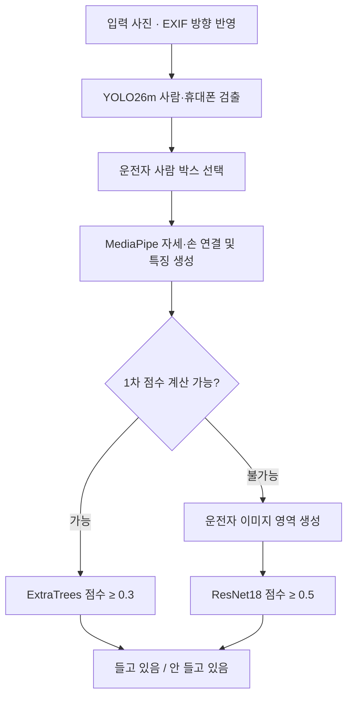

# 운전자 휴대폰 소지 분류기: 개선 과정 및 최종 확정 보고서

> 이 문서는 초기 모델의 개선 과정과 당시 140장 평가를 보존한 기록이다. 현재 기본 모델은 **공통 train 911장·test 146장 기준 재학습 모델**이며 [최신 재학습 보고서](RETRAIN_REPORT_20260916.md)를 따른다. 초기 모델은 `artifacts/old/`로 보관했다.

- 확정일: 2026-09-16
- 확정 구성: **YOLO26m·MediaPipe·ExtraTrees 1차 분류 + ImageNet 기반 ResNet18 2차 분류**
- 최종 판단: **들고 있음 / 안 들고 있음**
- 최종 테스트: **140장 전체**, Accuracy **89.29%**, Precision **85.90%**, Recall **94.37%**, F1 **89.93%**
- 초기 모델 식별 정보: [old_model.json](../configs/old_model.json)
- 수치 원본: [최종 평가 JSON](evidence/final_evaluation.json)

## 1. 목표와 판단 대상

백미러 부근 카메라로 촬영한 사진에서 **운전자가 휴대폰을 들고 있는지** 판단한다. 조수석이나 2열 승객의 휴대폰 소지를 운전자 행동으로 판단하지 않는 것이 중요한 요구사항이다.

`보고있음`과 `들고있음`은 모두 양성 라벨로 사용했다. 시선을 직접 측정하는 분류기가 아니며, 운전자가 전방을 보면서 휴대폰을 들고 있어도 양성이다. 동승자만 휴대폰을 들고 있는 경우는 음성이다.

최종 모델은 실내 연출 사진의 폴더 라벨로 학습했다. 실제 운전 환경에서 물리적인 파지를 완전히 증명하는 시스템으로 해석하지 않는다.

## 2. 최종 처리 구조

### 2.1 1차: 구조화된 특징으로 판단

1. YOLO26m으로 사람·휴대폰·컵·물병을 검출한다. YOLO는 우리 데이터로 파인튜닝하지 않았다.
2. 사람 박스의 크기·하단 위치로 앞자리 후보를 추리고, 지정된 운전석 방향의 사람을 선택한다. 기본값은 사진 오른쪽이다.
3. 운전자 사람 박스에 어깨 중점이 들어오는 자세를 연결한다. 운전자 자세가 없는데 동승자 자세만 검출되면 그 사람을 대신 사용하지 않는다.
4. MediaPipe의 몸·손 관절을 이용해 자세, 손목과 휴대폰 거리, 손바닥·손가락 끝 거리, 다른 사람의 손과의 거리 차이 등을 계산한다.
5. 어깨 너비 등으로 정규화한 특징을 ExtraTrees 분류기에 넣는다. 점수 0.3 이상은 양성, 미만은 음성이다.

MediaPipe도 사전학습 모델을 그대로 사용한다. 우리 데이터로 학습한 부분은 **최종 ExtraTrees와 2차 ResNet18**이다.

### 2.2 2차: 자세 추정 실패를 이미지로 보완

1차 특징을 만들 수 없을 때만 2차 모델을 사용한다. 단순히 1차 점수가 낮거나 중간이라는 이유로 전달하지 않는다.

- 운전자 사람 박스가 있으면 좌우 15%, 상하 8% 여유를 준 영역을 사용한다.
- 사람 박스도 없으면 사진 오른쪽 60%를 운전석 영역으로 사용한다. `--driver-side left`는 왼쪽 60%를 사용한다.
- 종횡비를 유지하며 320×320으로 패딩하고 ImageNet 정규화를 적용한다.
- ImageNet 사전학습 ResNet18 전체 층을 우리 학습 이미지로 추가 학습했다. 2차 점수 0.5 이상을 양성으로 판단한다.

2차에 전달되는 원본은 자세 추정에 실패한 사진일 수 있지만, 이미지 자체는 정상이다. 파일 손상·의존성 누락 등 실행 오류를 임의의 이진 결과로 바꾸지는 않는다.

### 2.3 점수 없음과 낮은 점수의 차이

**점수 없음은 휴대폰 소지 가능성이 낮다는 뜻이 아니라, 분류기에 넣을 특징을 만들지 못했다는 뜻**이다. 휴대폰이 검출되지 않아도 운전자 특징이 있으면 1차 점수를 계산할 수 있다.

최종 모델에서는 점수 없음을 일괄 양성 처리하지 않는다. 2차가 이미지에서 점수를 계산해 최종 결정을 내린다. 두 단계의 점수는 보정된 확률이 아니며, 서로 동일한 척도의 확률로 해석하지 않는다.

## 3. 개선 과정

### 3.1 최초 구성과 실행 환경 정리

초기에는 YOLO26n과 MediaPipe를 사용해 손과 휴대폰의 접촉 및 소유권을 규칙으로 판정했다. 카메라 위치를 수동 보정하는 경로도 마련했다. 이후 자동 운전자 선택과 특징 기반 ExtraTrees 분류를 기본 경로로 확장했다.

실행 과정에서는 Python 환경에 따른 OpenCV 누락과 `camera.json` 경로 문제를 확인했다. 현재 기본 분류 경로는 수동 보정 파일 없이 실행된다. 수동 보정 규칙은 `--rule-based`로 분리해 보존했다.

### 3.2 YOLO26n → YOLO26m, GPU 실행

기본 COCO 모델에 휴대폰 클래스가 포함돼 있다는 점을 활용해, 먼저 검출기 크기를 키우는 실험을 했다. 같은 개발 평가 사진과 고정 분류기로 YOLO26n과 YOLO26m을 비교했다.

**과거 `new dataset` 639장 중 점수가 있는 637장, 임계값 0.5 기준**이다. 양성은 301장이며, 점수 없는 양성 2장은 아래 지표에서 제외됐다.

| 검출기 | Accuracy | Precision | Recall | F1 | FP | FN |
|---|---:|---:|---:|---:|---:|---:|
| YOLO26n | 74.41% | 84.00% | 56.19% | 67.33% | 32 | 131 |
| YOLO26m | 84.46% | 90.32% | 74.92% | 81.90% | 24 | 75 |

이 실험에서는 m 모델이 미탐을 줄였다. 이후 NVIDIA RTX 4050 Laptop GPU에서 CUDA 실행을 확인했다. YOLO와 최종 2차 모델은 GPU를 사용하고 MediaPipe는 CPU를 사용한다. GPU 전환 자체를 정확도 개선으로 해석하지 않는다.

원본 기록: `artifacts/new_dataset/evaluation.json`, `artifacts/new_dataset_yolo26m_gpu/evaluation.json`.

### 3.3 미탐 원인 분석

YOLO26m 사용 후 남은 미탐 75장을 검토했다.

- 휴대폰 검출 신뢰도가 낮거나 검출 자체가 빠진 사례
- 휴대폰이 손가락 끝에 걸려 있어 손목 거리만으로 접촉 근거가 약한 사례
- 귀 옆·특이한 팔 자세 등 학습된 특징만으로 놓치는 사례
- 운전자 자세는 누락되고 동승자 자세만 남아 운전자가 잘못 선택된 사례

검출 실패와 최종 분류 실패를 분리해 살폈으며, 사진 전체에 휴대폰이 하나 검출됐다는 사실만으로 운전자 휴대폰 검출 성공이라고 간주하지 않았다.

### 3.4 동승자 대체 방지와 손바닥·손가락 특징 추가

독립적인 사람 검출로 운전자 후보를 정하고, 그 사람에게 연결할 자세가 없으면 1차 특징을 만들지 않도록 바꿨다. 자세가 하나라는 이유만으로 동승자를 운전자로 대체하던 경로를 막았다.

또한 운전자 손에 연결된 손바닥 중심과 다섯 손가락 끝의 휴대폰 박스까지 거리를 추가했다. 손목 거리만으로 표현하기 어려운 접촉을 보완하기 위한 변경이다.

| 과거 개발 평가 v4 | 값 |
|---|---:|
| 전체 이미지 | 639장 |
| 점수 계산 가능 / 불가능 | 577장 / 62장 |
| 점수 있는 사진의 Accuracy | 88.73% |
| Precision / Recall / F1 | 94.19% / 81.65% / 87.48% |

이 변경에는 운전자 선택 규칙, 특징 추가, 분류기 재학습이 함께 들어갔다. 어느 한 변경의 효과로 모두 귀속할 수 없다. 특히 점수 없는 사진이 증가했으므로 앞 단계의 637장 지표와 단순 비교하면 안 된다. 두 버전 모두 점수가 있는 동일 577장 비교에서는 F1이 83.10%에서 87.48%로 상승했다.

원본 기록: `artifacts/new_dataset_m_v4/evaluation.json`, `comparison.json`.

### 3.5 Recall 임계값 탐색과 판단 보류의 한계

v4 개발 예측 점수를 재사용해 임계값을 탐색했다. 점수가 있는 양성 중 점수 0인 사진이 있어 Recall 100%를 만들려면 모든 점수 있는 사진을 양성 처리해야 했다. 이때 Precision은 48.18%였다.

이 과정에서 **학습은 이진 분류지만 출력에는 판단 불가가 존재한다**는 점을 명확히 구분했다. 판단 불가를 제외한 높은 Recall만으로 전체 양성 검출 성능을 설명할 수 없었다.

그 뒤 판단 불가 없는 출력을 위해 임계값과 점수 결측 시 양성/음성 처리 방향을 train 교차검증 F1으로 선택했다. 선택 결과는 임계값 0.5265758057645732와 결측 양성 처리였다. 이는 모델이 결측 사진을 실제로 구분한 것이 아니라, 미탐과 오탐의 비용을 바꾼 정책이었다.

### 3.6 train/test 분리와 2차 모델 도입

사용자가 구성한 `dataset/train`만으로 분류기를 새로 학습하고 `dataset/test`를 평가했다. 이어 점수 없는 사진을 강제 양성 처리하는 대신 이미지 분류기를 통과시키는 최종 구조를 도입했다.

2차는 실패 사진만으로 학습하지 않았다. 데이터가 적기 때문에 train 전체의 운전자 영역으로 학습하고, 실제 전달 대상의 성능을 별도로 확인했다. 자세 좌표를 만들지 못해도 픽셀에서 손·휴대폰 정보를 활용할 수 있도록 한 구성이다.

## 4. 최종 학습·검증 절차

| 항목 | 내용 |
|---|---|
| train | 1,011장: 양성 381 / 음성 630 |
| 내부 학습 / 검증 | 731장 / 280장 |
| 분리 기준 | 파일명 IMG 번호의 100단위 묶음, GroupShuffleSplit, seed 42 |
| 1차 최종 학습 | 특징 생성 가능한 912장으로 ExtraTrees 재학습 |
| 2차 최종 학습 | train 1,011장 전체로 ImageNet 초기 가중치부터 파인튜닝 |
| 검증 탐색 | 최대 8 epoch, 각 단계 임계값 0.2~0.8의 0.1 간격 |
| 선택 기준 | 결합 시스템의 검증 F1, 동률이면 Recall·Precision 등 사전 정의한 순서 |
| 선택 결과 | 2 epoch, 1차 0.3 / 2차 0.5 |
| 최종 test | 140장: 양성 71 / 음성 69 |
| train/test 동일 파일 해시 중복 | 0장 |

검증 결과 전체 F1은 88.19%였다. 검증에서 2차로 전달된 사진은 15장(양성 2·음성 13)이었고 선택 시점에서는 모두 정답이었다. **특히 양성 검증 표본이 2장뿐이므로 이 부분의 100%를 안정적인 성능으로 해석할 수 없다.**

선택을 마친 후 train 전체로 두 모델을 각각 다시 학습했다. test 결과를 읽기 전에 [선택 설정](evidence/final_locked_selection.json)을 저장했고, 이번 실험에서는 test를 보고 임계값이나 epoch를 바꾸지 않았다. 두 모델의 출력을 조합하는 제3의 분류기는 학습하지 않았다.

## 5. 최종 테스트 결과와 선택 이유

아래는 **확정 실험 당시 test 140장을 모두 포함한 결과**다. 판단 불가로 제외한 사진은 없다.

| 방식 | Accuracy | Precision | Recall | F1 | TN | FP | FN | TP |
|---|---:|---:|---:|---:|---:|---:|---:|---:|
| 기존 이진 정책: 0.526576, 결측 양성 | 87.86% | 82.14% | 97.18% | 89.03% | 54 | 15 | 2 | 69 |
| 1차 0.3, 결측 양성 | 85.71% | 79.31% | 97.18% | 87.34% | 51 | 18 | 2 | 69 |
| **확정: 1차 0.3 + 2차 0.5** | **89.29%** | **85.90%** | **94.37%** | **89.93%** | **58** | **11** | **4** | **67** |
| 이미지 분류기 단독 0.5 | 82.14% | 78.75% | 88.73% | 83.44% | 52 | 17 | 8 | 63 |

TN은 음성 정답, FP는 음성을 양성으로 잘못 판단한 오탐, FN은 양성을 음성으로 판단한 미탐, TP는 양성 정답이다.

### 5.1 2차로 전달된 22장

| 실제 라벨 | 양성 예측 | 음성 예측 |
|---|---:|---:|
| 양성 11장 | 9 | 2 |
| 음성 11장 | 4 | 7 |

- Accuracy 72.73%, Precision 69.23%, Recall 81.82%, F1 75.00%.
- 1차 임계값을 0.3으로 동일하게 놓으면, 결측 전부 양성 대비 **오탐 7장 감소·미탐 2장 증가**가 2차 도입 효과다.
- 이전 기본 정책과 최종안을 비교하면 **오탐 15→11장, 미탐 2→4장**이다. 1차 임계값도 바뀌었기 때문에 모든 차이를 2차만의 효과로 설명하지 않는다.

### 5.2 확정 근거

최종안은 점수 없는 사진에 대해 실제 이미지 기반 판단을 수행하고, 기존 정책보다 Precision·Accuracy·F1이 개선됐다. F1 개선은 **0.90%p로 소폭**이며 Recall은 **2.82%p 감소**했다. 모든 지표에서 우월한 모델은 아니다.

사용자는 이 결과와 교환관계를 확인한 후 해당 구성을 최종안으로 확정했다. 이후의 추가 탐색으로 확정 모델을 자동 교체하지 않도록, 가중치 해시와 설정을 별도로 기록했다.

## 6. 평가 수치를 해석할 때 주의할 점

### 테스트 라벨 변경

이전 140장 평가에서는 양성 70·음성 70장이었다. 이후 `IMG_7624.jpg의 사본.jpg` 한 장이 음성 폴더에서 양성 폴더로 이동해 최종 모델 평가 당시에는 71·69장이었다. 그 두 평가의 이미지 해시 집합은 동일하며, 이번 작업에서 라벨을 변경하지 않았다. [변경 확인 기록](evidence/final_label_audit.json)을 보존했다.

최종 비교표의 기존 방식도 **최종 모델 평가 당시 라벨로 다시 계산**했다. 이전 대화의 70·70장 지표와 직접 비교하면 라벨 변경 효과가 섞인다.

저장소 정리 시점에는 라벨 폴더 이름이 `phone`(양성), `normal`(음성)로 변경돼 있었고, **데이터 구성도 달라졌다**. 확인 시 train은 911장(양성 401·음성 510), test는 146장(양성 77·음성 69)이었다. 확정 실험 대비 train은 파일 해시 23개 추가·123개 제외, test는 6개 추가됐고, 양쪽에 공통으로 있는 이미지의 라벨 의미 변경은 없었다.

[데이터 변경 확인 기록](evidence/final_data_layout.json)에 해시 목록을 남겼다. 확정 요청은 기존 모델과 개선 과정을 정리하는 작업이므로 이 새 데이터로 재학습하거나 기존 지표를 교체하지 않았다. **이 보고서의 최종 성능은 당시 140장 기준이며 현재 146장 전체의 성능은 아니다.** 입력 도구는 한국어·영어 라벨 쌍을 모두 인식하도록 정리했고, 과거 CSV의 경로 문자열은 당시 기록으로 보존한다.

### 분모와 일반화

- 과거 개발 지표는 점수 없는 사진 또는 판단 보류 사진을 제외한 경우가 있다. 최종 지표는 140장 전체를 포함한다.
- test 사진은 과거 `new dataset` 개발 평가에 등장했다. 이번 학습·임계값 선택에서는 제외했지만, 완전히 새로운 외부 검증 데이터는 아니다.
- 촬영 번호 묶음 분리가 같은 사람·실내·인접 장면을 모두 분리한다는 보장은 없다. 완전히 새로운 운전자·차량에서의 일반화 성능은 확인하지 않았다.
- 2차 검증 대상이 적고, 카메라가 바뀌면 운전석 영역 가정이 달라질 수 있다. 동승자·야간·가림·거치대 등의 조건을 포함한 별도 평가가 필요하다.
- 운전자 사람 검출까지 잘못되면 잘못된 영역이 두 단계에 영향을 줄 수 있다. 동승자 대체 방지는 모든 상황에서 운전자 신원을 보장하는 기능은 아니다.

## 7. 확정 모델과 재현 기록

| 역할 | 위치 |
|---|---|
| 기본 실행 bundle | `artifacts/classifier.joblib` |
| 확정 실험 bundle | `artifacts/cascade_20260916/classifier.joblib` |
| 2차 가중치 | `artifacts/cascade_20260916/stage2.pt` |
| 최종 테스트 사진별 결과 | `artifacts/cascade_20260916/predictions.csv` |
| 실제 평가 코드 검증 결과 | `artifacts/cascade_20260916/verified/` |
| 학습 분할·선택 이력 | 해당 실험의 `split.json`, `validation_history.json`, `locked_selection.json` |
| 이전 기본 모델 | 해당 실험의 `previous_default.joblib` |
| 버전 관리할 지표 사본 | `docs/evidence/` |
| 확정 설정·가중치 해시 | `configs/final_model.json` |

기본 bundle과 확정 실험 bundle이 동일함을 확인했다. `configs/final_model.json`은 확정 상태를 기록하는 문서이며, 실행 시 설정을 덮어쓰는 파일이 아니다. 실제 임계값은 bundle에 들어 있다.

최종 모델 생성 후 실제 `evaluate_dataset.py` 경로와 학습 스크립트의 테스트 결과가 일치했고, 1차 직접 판정·2차 양성·2차 음성 추론 경로를 확인했다. 당시 코드 테스트 31개를 통과했다. 저장소 정리 후 라벨 인식 테스트를 추가해 **34개를 통과**했고, CLI import·확정 모델 해시·기본 `main.py`의 실제 GPU 1차/2차 추론도 다시 확인했다. 실제 추론 확인 중 발견한 `pi-heif` 누락은 가상환경과 의존성 목록에 반영했다. 가중치와 임계값은 정리 전후 동일하다.

## 8. 저장소 정리

실행에 필요한 핵심 모듈과 `main.py`는 프로젝트 루트에 유지했다. 학습·과거 실험·테스트·문서는 역할별로 분리했다.

- `training/`: 1차 및 결합 시스템 학습 진입점. `python -m training.train_cascade` 형태로 실행한다.
- `experiments/`: 검출기 비교, 특징 비교, 미탐 분석, 과거 이진 임계값 탐색.
- `tests/`: 기능 검증.
- `legacy/`: 수동 보정 기반 최초 규칙. `main.py --rule-based`에서만 사용한다.
- `docs/`: 이 보고서, 실행·학습 절차, 최종 수치 원본 사본.
- `docs/archive/`: 정리 이전 README와 초기 개발 평가. 당시 기록이며 현재 명령·성능 안내가 아니다.
- `configs/`: 확정 모델 식별 정보.

원본 데이터, 검출 캐시, 모델 가중치, 과거 실험 산출물은 보존했다. 이들은 용량과 데이터 특성상 기존처럼 Git 추적에서 제외한다. 실행 및 재학습 명령은 [RUNBOOK.md](RUNBOOK.md), 프로젝트 첫 안내는 [README.md](../README.md)를 따른다.
